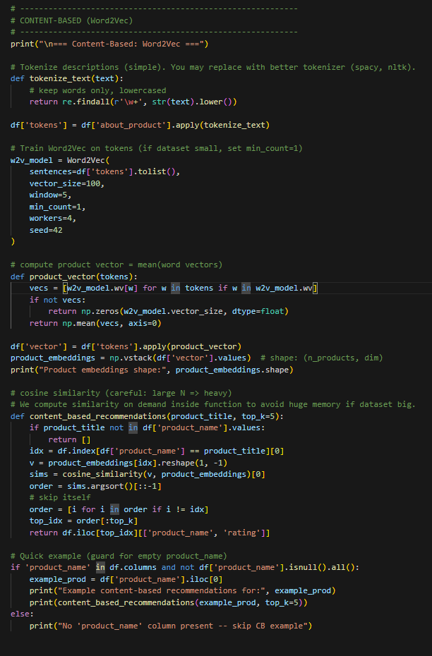
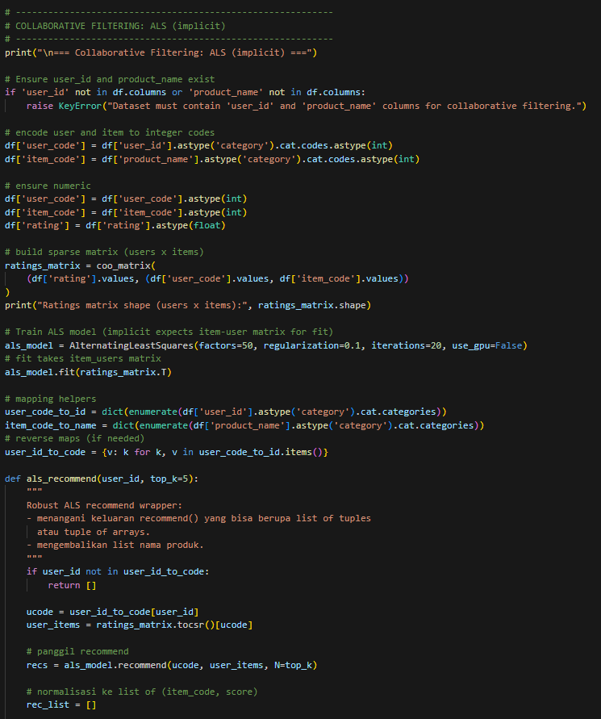
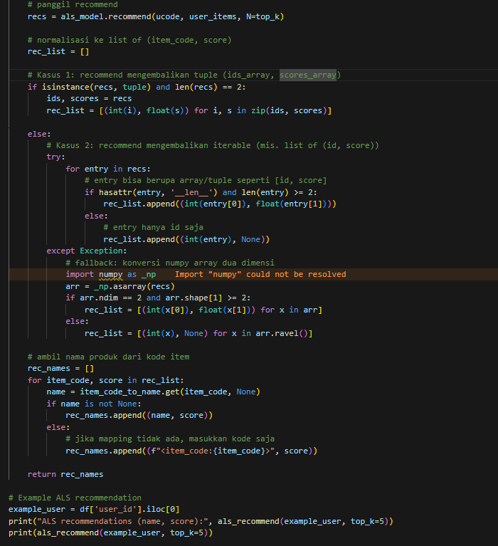

README - Sistem Rekomendasi Produk

Project ini adalah notebook Python untuk membangun sistem rekomendasi produk
berdasarkan dataset `amazon.csv`. Sistem ini menggabungkan dua pendekatan utama:
Content-Based Filtering (Word2Vec) dan Collaborative Filtering (ALS).
```BASE
asdfas fsaef asdfjnasefjn asuefhu sieufh oasjdfhasoieufh
```

------------------------------------------------------------
1. Persiapan & Instalasi
------------------------------------------------------------
- Install library yang dibutuhkan: numpy, pandas, gensim, implicit
- Import library tambahan: Word2Vec, ALS, matplotlib, seaborn (opsional)

------------------------------------------------------------
2. Load Dataset
------------------------------------------------------------
- Dataset dibaca dari path yang sudah ditentukan (misalnya Google Drive)
- Kolom penting: 
  * user_id
  * product_name
  * about_product (deskripsi produk)
  * rating
- Data cleaning:
  * Mengisi kolom deskripsi jika kosong
  * Membersihkan kolom rating agar numerik
  * Menghapus data yang tidak lengkap

------------------------------------------------------------
3. Content-Based Filtering (Word2Vec)
------------------------------------------------------------
- Tokenisasi teks deskripsi produk
- Latih Word2Vec untuk representasi kata
- Hitung vektor produk sebagai rata-rata vektor kata
- Rekomendasi berdasarkan cosine similarity antar produk
- Fungsi: content_based_recommendations(product_title, top_k)



------------------------------------------------------------
4. Collaborative Filtering (ALS - Implicit)
------------------------------------------------------------
- Encode user_id dan product_name menjadi kode numerik
- Buat sparse matrix (user x item) dengan nilai rating
- Latih model ALS (Alternating Least Squares)
- Rekomendasi produk untuk pengguna tertentu
- Fungsi: als_recommend(user_id, top_k)




------------------------------------------------------------
5. Evaluasi & Visualisasi
------------------------------------------------------------
- Hitung produk dengan rating tertinggi dan terendah
- Visualisasi Top 5 dan Bottom 5 produk dengan bar chart

------------------------------------------------------------
Kesimpulan
------------------------------------------------------------
Notebook ini menggabungkan dua pendekatan:
1. Content-based: rekomendasi produk mirip berdasarkan deskripsi
2. Collaborative filtering: rekomendasi produk berdasarkan pola rating pengguna lain

Pengguna dapat memperluas sistem ini untuk aplikasi e-commerce, analisis preferensi, atau personalisasi katalog produk.

